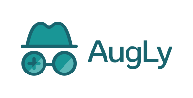
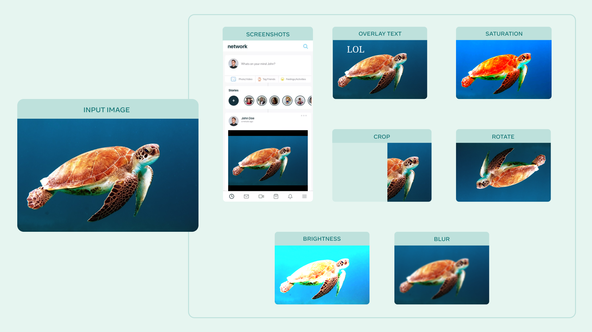

<p align="center">
  
</p>

----------------------

AugLy is a data augmentations library that currently supports four modalities ([audio](augly/audio), [image](augly/image), [text](augly/text) & [video](augly/video)) and over 100 augmentations. Each modality’s augmentations are contained within its own sub-library. These sub-libraries include both function-based and class-based transforms, composition operators, and have the option to provide metadata about the transform applied, including its intensity.

AugLy is a great library to utilize for augmenting your data in model training, or to evaluate the robustness gaps of your model! We designed AugLy to include many specific data augmentations that users perform in real life on internet platforms like Facebook's -- for example making an image into a meme, overlaying text/emojis on images/videos, reposting a screenshot from social media. While AugLy contains more generic data augmentations as well, it will be particularly useful to you if you're working on a problem like copy detection, hate speech detection, or copyright infringement where these "internet user" types of data augmentations are prelevant.



To see more examples of augmentations, open the Colab notebooks in the README for each modality! (e.g. image [README](augly/image) & [Colab](https://colab.research.google.com/github/facebookresearch/AugLy/blob/main/examples/AugLy_image.ipynb))

The library is Python-based and requires at least Python 3.6, as we use dataclasses.

## Authors

[**Joanna Bitton**](https://www.linkedin.com/in/joanna-bitton/) — Software Engineer at Facebook AI

[**Zoe Papakipos**](https://www.linkedin.com/in/zoe-papakipos-8637155b/) — Research Engineer at FAIR

## Installation

`AugLy` is a Python 3.6+ library. It can be installed with:

```bash
pip install augly
```

Or clone AugLy if you want to be able to run our unit tests, contribute a pull request, etc:
```bash
git clone git@github.com:facebookresearch/AugLy.git
[Optional, but recommended] conda create -n augly && conda activate augly && conda install pip
pip install -e AugLy/
```

*NOTE*: In some environments, `pip` doesn't install `python-magic` as expected. In that case, you will need to additionally run:
```bash
conda install -c conda-forge python-magic
```

Or if you aren't using conda:
```bash
sudo apt-get install python3-magic
```

## Documentation

To find documentation about each sub-library, please see the READMEs in the respective directories.

## Assets

We provide various media assets to use with some of our augmentations. These assets include:
1. [Emojis](augly/assets/twemojis/) ([Twemoji](https://twemoji.twitter.com/)) - Copyright 2020 Twitter, Inc and other contributors. Code licensed under the MIT License. Graphics licensed under CC-BY 4.0.
2. [Fonts](augly/assets/fonts/) ([Noto fonts](https://www.google.com/get/noto/)) - Noto is a trademark of Google Inc. Noto fonts are open source. All Noto fonts are published under the SIL Open Font License, Version 1.1.
3. [Screenshot Templates](augly/assets/screenshot_templates/) - Images created by a designer at Facebook specifically to use with AugLy. You can use these with the `overlay_onto_screenshot` augmentation in both the image and video libraries to make it look like your source image/video was screenshotted in a social media feed similar to Facebook or Instagram.

## Citation

If you use AugLy in your work, please cite:

```bibtex
@misc{bitton2021augly,
  author =       {Bitton, Joanna and Papakipos, Zoe},
  title =        {AugLy: A data augmentations library for audio, image, text, and video.},
  howpublished = {\url{https://github.com/facebookresearch/AugLy}},
  year =         {2021}
}
```

## License

AugLy is MIT licensed, as found in the [LICENSE](LICENSE) file. Please note that some of the dependencies AugLy uses may be licensed under different terms.
